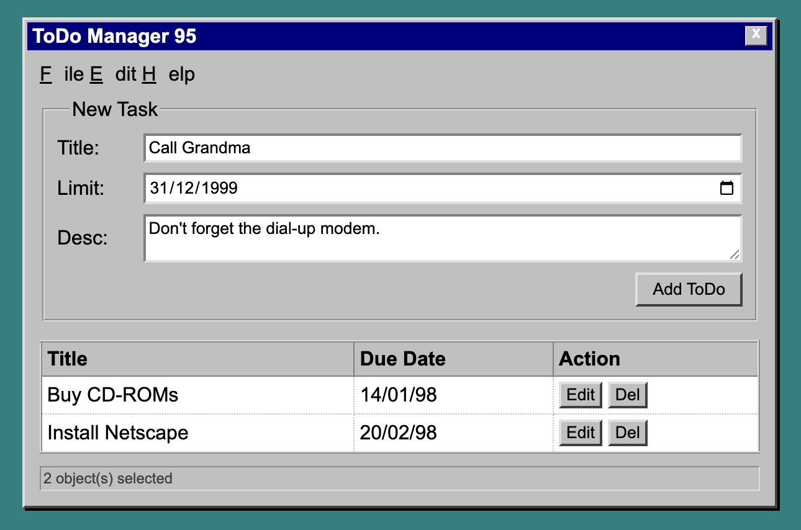

# Todo App Implementation Plan (Vanilla JavaScript)

## Design Reference

Use the design mock as the UI target:



## Architecture Overview

The app will follow separation of concerns with three main layers:

1. **Data Layer**: Local storage service for persistence
2. **Business Logic Layer**: TodoManager class/module for todo operations
3. **Presentation Layer**: DOM manipulation and event handling modules

## Project Structure

```
shouldweusereact/
└── vanillajsapp/
    ├── package.json
    ├── vite.config.js
    ├── index.html
    ├── src/
    │   ├── main.js (entry point)
    │   ├── app.js (app initialization)
    │   ├── index.css (styles matching design)
    │   ├── services/
    │   │   └── localStorage.js (data persistence layer)
    │   ├── models/
    │   │   └── TodoManager.js (business logic layer)
    │   ├── views/
    │   │   ├── TodoForm.js (form rendering and handling)
    │   │   ├── TodoList.js (list rendering)
    │   │   └── TodoItem.js (individual todo rendering)
    │   └── utils/
    │       └── dateFormatter.js (date formatting utilities)
```

## Implementation Details

### 1. Project Setup

- Create `vanillajsapp` folder in project root
- Initialize Vite project with vanilla template inside `vanillajsapp`
- Configure `vanillajsapp/package.json` with Vite only (no React)
- Set up `vanillajsapp/index.html` entry point
- Create base CSS reset and typography matching design
- Use ES6 modules for code organization

### 2. Data Layer (`vanillajsapp/src/services/localStorage.js`)

- `getTodos()`: Retrieve todos from localStorage
- `saveTodos(todos)`: Persist todos to localStorage
- `STORAGE_KEY`: Constant for localStorage key
- Handle JSON parsing errors gracefully
- Return empty array if no data exists
- Export functions as ES6 module

### 3. Business Logic Layer (`vanillajsapp/src/models/TodoManager.js`)

TodoManager class/module managing todo state and operations:

- `todos`: Private array of todo objects
- `addTodo(todo)`: Add new todo (name, description?, limitDate)
- `updateTodo(id, updates)`: Update existing todo
- `deleteTodo(id)`: Remove todo
- `getTodos()`: Get all todos
- `getTodoById(id)`: Get single todo by ID
- `loadTodos()`: Load from localStorage
- `saveTodos()`: Save to localStorage
- Event emitter pattern or callback system for state changes
- Auto-save to localStorage on any change

Todo object structure:

```javascript
{
  id: string (timestamp-based),
  name: string,
  description: string | null,
  limitDate: string (ISO date),
  completed: boolean,
  createdAt: string (ISO date)
}
```

### 4. Presentation Layer

#### `vanillajsapp/src/app.js`

- App initialization and coordination
- Creates TodoManager instance
- Sets up event listeners
- Initializes views
- Handles app lifecycle

#### `vanillajsapp/src/views/TodoForm.js`

- Form rendering and DOM manipulation
- Fields: name (required), description (optional textarea), limitDate (date input)
- Form submission handler
- Validation for required fields
- Clear form after submission
- Edit mode support (pre-fill form with existing todo data)
- Form layout matching design
- Event delegation for form interactions

#### `vanillajsapp/src/views/TodoList.js`

- List container rendering
- Renders list of todos using TodoItem
- Handles empty state display
- Grid/list layout matching design
- Re-renders on todo state changes

#### `vanillajsapp/src/views/TodoItem.js`

- Individual todo card/item rendering
- Shows name, description (if exists), limitDate
- Edit mode toggle (inline editing or form mode)
- Delete button with event handler
- Complete/checkbox toggle
- Date formatting using dateFormatter utility
- Visual indicators for overdue/upcoming dates
- Creates DOM elements programmatically
- Event handlers for interactions

#### `vanillajsapp/src/utils/dateFormatter.js`

- `formatDate(dateString)`: Format date for display
- `getRelativeDate(dateString)`: Get relative dates ("Today", "Tomorrow", or formatted date)
- `isOverdue(dateString)`: Check if date is overdue
- `isUpcoming(dateString)`: Check if date is upcoming

### 5. Styling (`vanillajsapp/src/index.css`)

Pixel-perfect implementation of design mock:

- Match design exactly (colors, spacing, typography, layout)
- Typography matching design specifications
- Color scheme from design
- Card-based layout for todos as shown in design
- Button sizes and styles matching design
- Smooth transitions and hover states
- Flexbox/Grid for layout as specified in design
- CSS classes for different states (editing, completed, overdue)

### 6. Entry Point (`vanillajsapp/src/main.js`)

- Imports app.js
- Initializes application on DOMContentLoaded
- Sets up global error handling

## Features

**Add Todo:**

- Form with name (required), description (optional), limitDate
- Validation feedback (visual indicators)
- Clear form after submission
- Add button triggers TodoManager.addTodo()

**Edit Todo:**

- Click todo item to enter edit mode
- Form pre-filled with existing todo data
- Inline editing preserves all fields
- Save/Cancel buttons
- Update button triggers TodoManager.updateTodo()

**Delete Todo:**

- Delete button on each todo item
- Confirmation (optional: simple confirm dialog)
- Delete button triggers TodoManager.deleteTodo()

**Persistence:**

- Auto-save to localStorage on any change
- Load todos on app initialization
- Handle localStorage errors gracefully
- TodoManager automatically persists on state changes

**Pixel-Perfect Design:**

- Match design mock exactly
- Consistent layout as specified in design
- Exact colors, spacing, and typography from design

**State Management:**

- TodoManager maintains single source of truth
- Views subscribe to state changes (callback pattern)
- Re-render views when todos change
- Event-driven architecture

## File Changes

1. **New files:**

   - `vanillajsapp/package.json` - Dependencies (Vite only)
   - `vanillajsapp/vite.config.js` - Vite configuration
   - `vanillajsapp/index.html` - HTML entry point
   - `vanillajsapp/src/main.js` - Application entry point
   - `vanillajsapp/src/app.js` - App initialization and coordination
   - `vanillajsapp/src/index.css` - Global styles
   - `vanillajsapp/src/services/localStorage.js` - Data persistence
   - `vanillajsapp/src/models/TodoManager.js` - Business logic
   - `vanillajsapp/src/views/TodoForm.js` - Form rendering and handling
   - `vanillajsapp/src/views/TodoList.js` - List rendering
   - `vanillajsapp/src/views/TodoItem.js` - Individual todo rendering
   - `vanillajsapp/src/utils/dateFormatter.js` - Date utilities

2. **Update:**

   - `.gitignore` - Add vanillajsapp/node_modules, vanillajsapp/dist, etc.

## Technical Decisions

- **ID Generation**: Use `Date.now().toString()` or `crypto.randomUUID()` if available
- **Date Handling**: Store dates as ISO strings, use native Date API for formatting
- **State Management**: TodoManager class with private state and public methods
- **DOM Manipulation**: Use `document.createElement`, `appendChild`, `textContent`, etc.
- **Event Handling**: Event listeners and event delegation
- **Module System**: ES6 modules (import/export)
- **Re-rendering**: Manual DOM updates when state changes (no virtual DOM)
- **Error Handling**: Try-catch blocks around localStorage operations
- **Accessibility**: Semantic HTML, ARIA labels where needed, keyboard navigation
- **Code Organization**: Separation by concern (services, models, views, utils)

## State Management Pattern

The TodoManager will use a simple observer/callback pattern:

```javascript
class TodoManager {
  constructor() {
    this.todos = [];
    this.listeners = [];
  }

  subscribe(callback) {
    this.listeners.push(callback);
  }

  notify() {
    this.listeners.forEach((cb) => cb(this.todos));
  }

  addTodo(todo) {
    // ... add logic
    this.saveTodos();
    this.notify();
  }
}
```

Views will subscribe to TodoManager and re-render when state changes.

## Testing Considerations

- Manual testing checklist:
  - Add todo with all fields
  - Add todo with only name
  - Edit todo
  - Delete todo
  - Refresh page (persistence check)
  - Verify pixel-perfect match with design mock
  - Test form validation
  - Test date formatting
  - Test state persistence across page reloads
